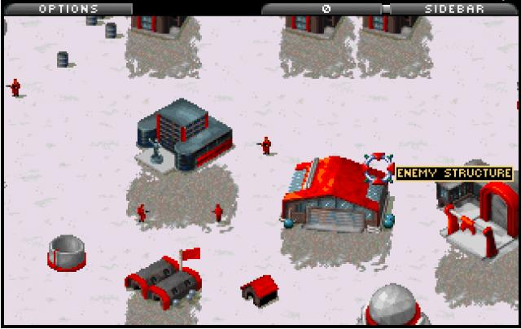
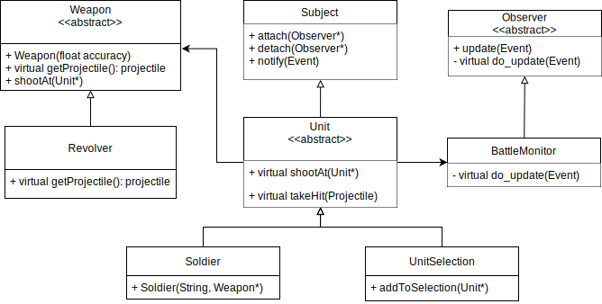

# Software Engineering: Assignement 12

In the lecture you have been introduced to the concept of software reuse.
The motivation for this is quite simple, the more of the functionality can be reused, the less code you will have to write from scratch.
As a result the product can be shipped faster or additional effort can be spent on developing a better product with more features.

Code reuse happens at different levels. At the most general level, using standard libraries is a form of reuse.
To see the amount of work you have saved simply open the source files and you will quickly realize that you have saved quite a bit of work.
At a higher level you may reuse may reuse common components for multiple products.

The key to writing reusable code is to realize that complex functionality can be implemented by combining several pieces of more generic functionality.
In the context of object oriented programming this means that we want to decompose complex classes into several smaller classes.
The tools to archive this are design patterns, which hopefully have a familiar concept by now.



# Exercise

In this exercise we will implement part of a _real-time strategy_ (RTS) game, like the Age Of Empires, Warcraft, and Red Alert series.
The structure is somewhat familiar to the one we saw in assignment 2.

Below is an overview classes:



- Unit: abstract class defining the interface of a unit.
- Weapon: abstract base class for weapons. The class implements the logic of shooting at units, and relies on the concrete implementation to produce the correct projectile.
- Subject: part of a observer pattern.
- Observer: part of observer pattern.
- UnitEvent: object inheriting from `Unit` and `Subject` i.e it is a unit which can also notify.
- **BattleMonitor**: an observer that prints information about which units has been hit.
- **Soldier**: concrete implementation of a unit that uses a weapon to shoot at other units.
- **UnitSelection**: composite pattern allowing multiple units to be treated as one.
- **Revolver**: concrete instance of weapon.

**classes in bold are to be implemented by you, the rest are provided**

## Steps

Examine the test case described in `tests/src/test_wargame.cpp`.
This should provide an overview of the intended functionality of the program.

1. implement the `Revolver::get_projectile` method. This should return a reference to a projectile. _Hint: store the projectile as part of the object and return a reference to this_

2. implement the `Soldier::shootAt` method. This should invoke the `Weapon::shootAt` method.

3. implement the `Soldier::takeHit` method. This should invoke the `Subject::notify` method with a string formatted as follows:

   ```
   ${name} got hit for ${projectile_damage} damage
   ```

   Hint use the `stringstream` object to format the string.

4. implement the `BattleMonitor::do_update` function which is inovked whenever a unit is hit. This should store the message received through the event in the instance variable `messages`. Hint you can access the message within the object like so:

   ```cpp
   UnitEvent *e = static_cast<UnitEvent *>(event);
   std::cout << e->message << std::endl;`
   ```

   _The reason the cast is related to templates and virtual methods and is not crucial to understand the assignment._

5. run the unit tests. Your code should now pass the first section of the tests.

6. Implement the `UnitSelection::addToSelection`, this should store a pointer of the unit in the `selected` instance variable.

7. Implement the `UnitSelection::shootAt`, this should cause each unit in the selection to attack the specified unit.

8. Implement the `UnitSelection::takeHit`, this should cause each unit in the selection to take a hit, as if targeted normally.

9. re-run the tests. Now the final test section should pass.
